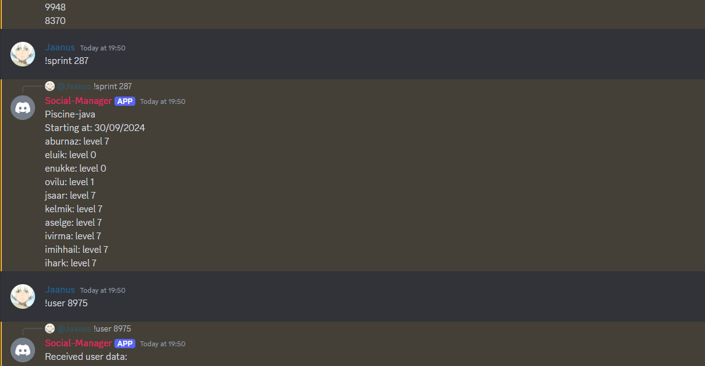

# Discord project for school

## Project Description

Created discord bot for simple school GraphQL fetches.

## Table of Contents

- [Screenshot Link](#screenshot)
- [Contributing](#contributing)
- [License](#license)
- [Contact](#contact)
- [Authors](#authors)

## Screenshots

## Contributing

We welcome contributions! Please contact one of the authors in discord if you would like to contribute to future projects.

## License

This project is licensed under the MIT License. See the [LICENSE](https://opensource.org/license/mit) file for details.

## Contact

For any questions or suggestions, feel free to contact us directly at `Kood / Jõhvi Discord`.

## Authors

_Authors: [Jaanus Saar](https://01.kood.tech/git/jsaar)_
