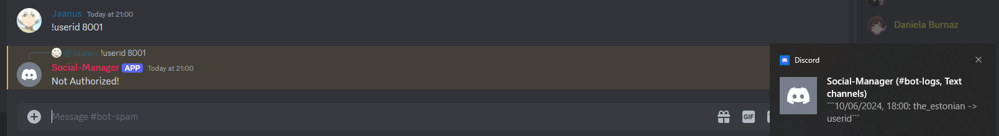
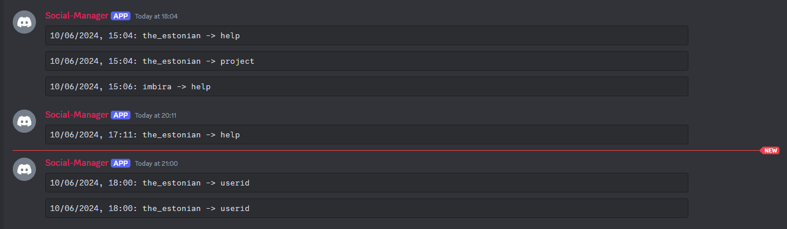

# Discord project for school

## Project Description

This is a personal project and only to be used by K/J members/staff.

Features:

User needs proper discord server role to use the bot.

Unauthorize access will be logged in a separate channel and AWS S3 bucket.

User server join/leave will be logged to bot channel and also saved to AWS S3 bucket.

Commands below will fetch the user/project data via GraphQL or school API via json and present it via reply to the command.

NB: User auth needed for the project to work.

## Table of Contents

- [Command List](#commandlist)
- [Screenshot Link](#screenshot)
- [Contributing](#contributing)
- [License](#license)
- [Contact](#contact)
- [Authors](#authors)

## Command list

```bash
┌───────────────────────────────────────────────────────────────────────────┐
│  Super Mega ULTRA Bot Version: version filled automatically               │
├─────────────────────────────┬─────────────────────────────────────────────┤
│ Project status:             │ WIP                                         │
├─────────────────────────────┼─────────────────────────────────────────────┤
│ !sprint <id>                │ to get the current sprinters data           │
├─────────────────────────────┼─────────────────────────────────────────────┤
│ !userid <id>                │ to get user data with the given id          │
├─────────────────────────────┼─────────────────────────────────────────────┤
│ !firstname <name>           │ to get all user with the given first name   │
├─────────────────────────────┼─────────────────────────────────────────────┤
│ !firstname <name><lastname> │ to get users with the name and lastname     │
├─────────────────────────────┼─────────────────────────────────────────────┤
│ !lastname <name>            │ to get all users with the given last name   │
├─────────────────────────────┼─────────────────────────────────────────────┤
│ !project <name>             │ to get project info                         │
├─────────────────────────────┼─────────────────────────────────────────────┤
│ !remove <n>                 │ to remove n amount of messages from channel │
├─────────────────────────────┼─────────────────────────────────────────────┤
│ !crash                      │ Implements server crash for testing         │
├─────────────────────────────┴─────────────────────────────────────────────┤
│        NB: Bot will delete his response and your command in 30s           │
└───────────────────────────────────────────────────────────────────────────┘
```

## Screenshots





## Contributing

We welcome contributions! Please contact one of the authors in discord if you would like to contribute to future projects.

## License

This project is licensed under the MIT License. See the [LICENSE](https://opensource.org/license/mit) file for details.

## Contact

For any questions or suggestions, feel free to contact us directly at `Kood / Jõhvi Discord`.

## Authors

_Authors: [Jaanus Saar](https://01.kood.tech/git/jsaar)_
