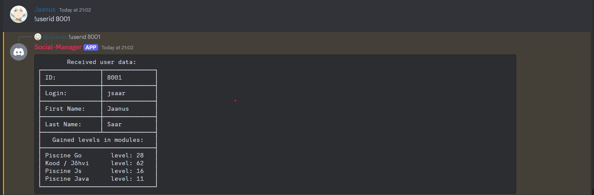

# Discord project for school

## Project Description

Created discord bot for simple school GraphQL fetches.

This is a personal project and only to be used by K/J members/staff.

NB: User auth needed for the project to work.

## Table of Contents

- [Command List](#commandlist)
- [Screenshot Link](#screenshot)
- [Contributing](#contributing)
- [License](#license)
- [Contact](#contact)
- [Authors](#authors)

## Command list

```bash
┌─────────────────────────────┬───────────────────────────────────────────┐
│ Project status:             │ WIP                                       │
├─────────────────────────────┼───────────────────────────────────────────┤
│ !sprint <id>                │ to get the current sprinters data         │
├─────────────────────────────┼───────────────────────────────────────────┤
│ !userid <id>                │ to get user data with the given id        │
├─────────────────────────────┼───────────────────────────────────────────┤
│ !firstname <name>           │ to get all user with the given first name │
├─────────────────────────────┼───────────────────────────────────────────┤
│ !firstname <name><lastname> │ to get users with the name and lastname   │
├─────────────────────────────┼───────────────────────────────────────────┤
│ !lastname <name>            │ to get all users with the given last name │
├─────────────────────────────┼───────────────────────────────────────────┤
│ !project <name>             │ to get project info                       │
└─────────────────────────────┴───────────────────────────────────────────┘
```

## Screenshots





## Contributing

We welcome contributions! Please contact one of the authors in discord if you would like to contribute to future projects.

## License

This project is licensed under the MIT License. See the [LICENSE](https://opensource.org/license/mit) file for details.

## Contact

For any questions or suggestions, feel free to contact us directly at `Kood / Jõhvi Discord`.

## Authors

_Authors: [Jaanus Saar](https://01.kood.tech/git/jsaar)_
